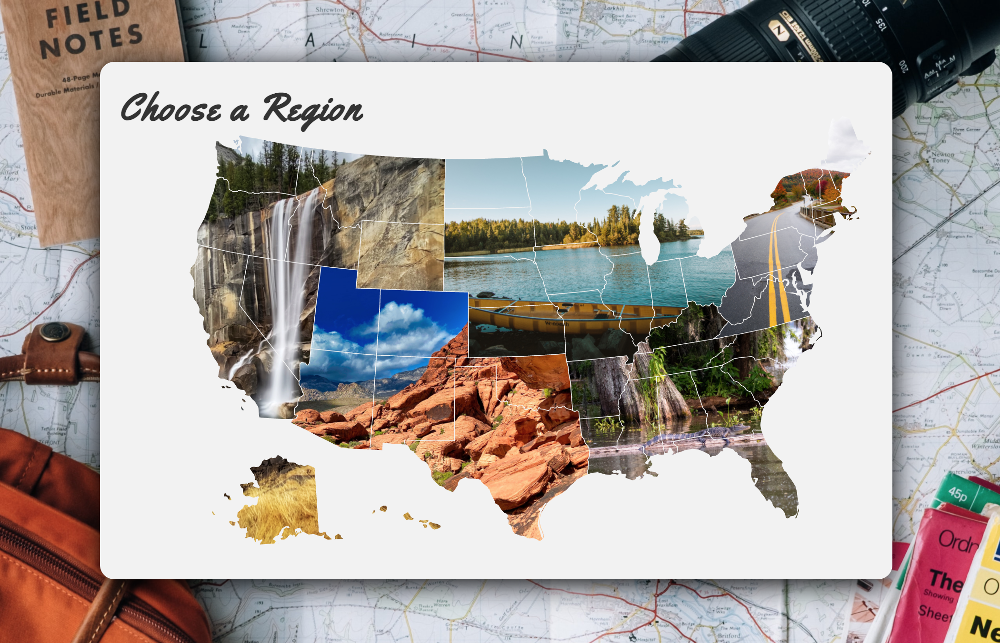
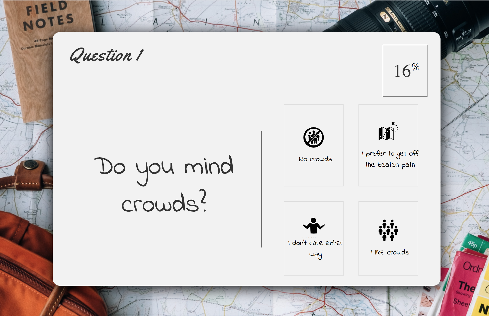
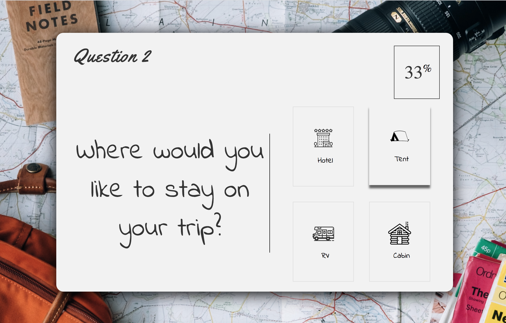
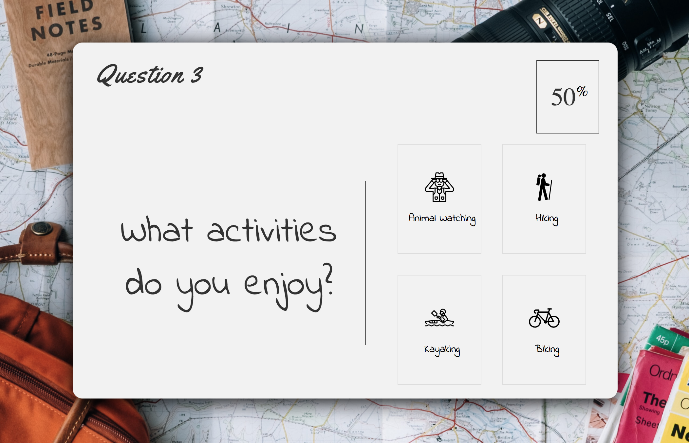
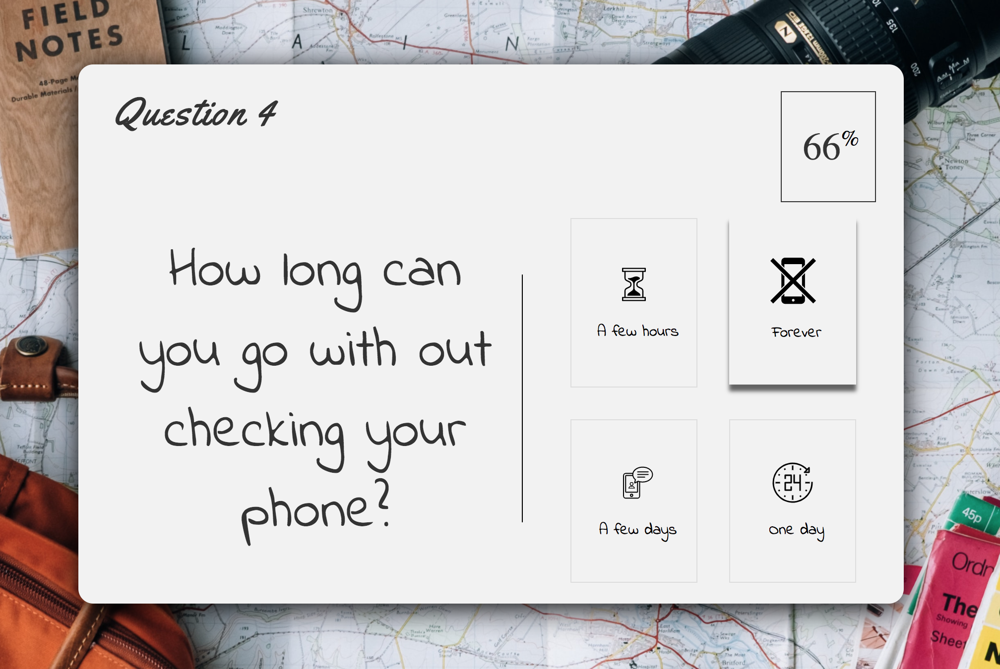
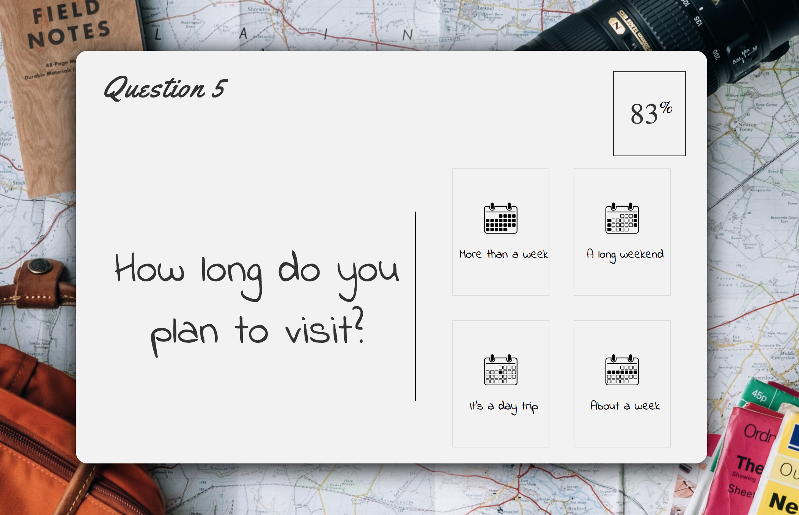
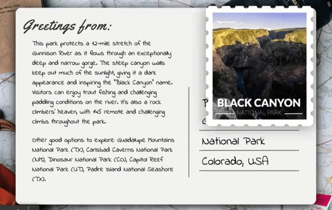

# NationalParksQuiz.github.io

### Summary
This is a quiz application using HTML, CSS and Javascript. It emphasizes the use of Javascript to provide quiz questions, collect user data, and then generate a results based based on that data.

### Access
This project has been deployed to GitHub Pages. To get this project up and running, you can follow the deployment link. Or, download the sources files to use this as a template.

* [GitHub Repository](https://github.com/Atwater1/NationalParksQuiz.github.io)
* [Deployed GitHub IO](https://atwater1.github.io/NationalParksQuiz.github.io/)

### Prerequisites

To install this application, you will need a text editor. I recommend Visual Studio Code. 

### Installing

To install this code, download the zip file, or use GitHub's guidelines to clone the repository. 

### This project has the following features:

* A Start Page
  
   * Informs user that quiz uses local storage, directs user to next page.
   

* A Location Page

  *  Custom SVG map of the US. User clicks region, which is recorded in local storage as user is directed to next page.
  

* A Game Page
  * Multiple choice options with corresponding SVGs dynamically generated by Javascript. Answers are recorded and stored.

 
 
 
 
 

* A Results Page
  * The mode is calculated from the answers of the questions and paired with the stored region answer to dynamically populate the corresponding National Park result. Animated stamp to show the user their location.
  
      
  

### Acknowledgments

All photos used in this project are copyright free, courtesy of Unsplash.com

All Icons used in this projects are courtesy of the Noun Project (thenounproject.com). Their author attributes are as follows:

Avoid Crowds by Victoruler from the Noun Project

Shrug by Simcoach Games from the Noun Project

Crowd by Adrien Coquet from the Noun Project

Map by Andrew Laskey from the Noun Project

Hotel by Made by Made from the Noun Project

Tent by designvector from the Noun Project

RV by Wireform from the Noun Project

Cabin by Ben Davis from the Noun Project

Observation by Turkkub from the Noun Project

Hiker by Blaise Sewell from the Noun Project

Kayak by luketaibai from the Noun Project

Bike by Arif Arif from the Noun Project

Hourglass by Icon Lauk from the Noun Project

No Phone by corpus delicti from the Noun Project

Talking on the phone by Caitlin George from the Noun Project

24 hours by JunGSa from the Noun Project

Day by Rohit Arun Rao from the Noun Project

Week by Rohit Arun Rao from the Noun Project

Weekends by Rohit Arun Rao from the Noun Project

Month by Rohit Arun Rao from the Noun Project
